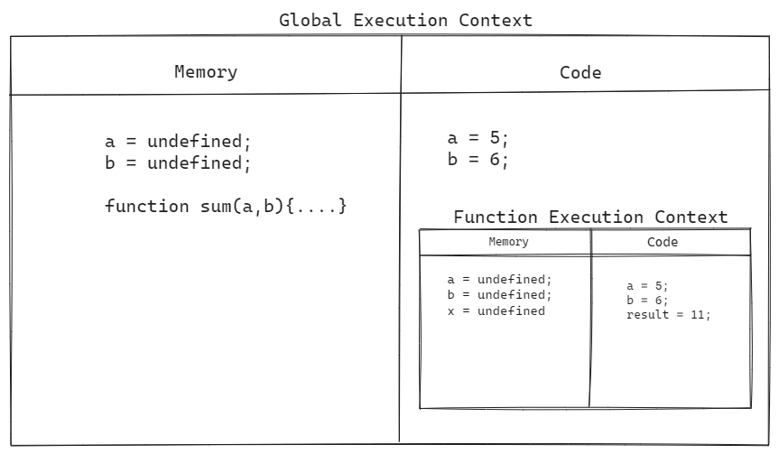

# Question: Explain what is execution context in detail with diagram

- When JavaScript engine scans the code it creates an environment called Execution context, which is responsible for the scanning and execution of the code.

- There are two types of execution context in the JavaScript:

1. Global execution context.
2. Function execution context.

- The Global context is created when the Javascript runs the script and it represents the global scope. The function context is created when function is called and it represents the function scope.

- The Execution context is mainly divided into two parts:

1. Memory

- When the script runs the JavaScript engine first scans the code line by line in the memory. It scans the variables and initialize it with undefined and it scans the functions and make it available everywhere.

2. Code

- After the scanning of the code the execution process starts in the Code. In the code, each line of the code is executed line by line from top to bottom. The variables are assigned it's value and for the functions another function execution context is created when the function is called.

**Example**

```
let a = 5;
let b = 6;

function sum(a,b){
    let result = a + b;
    return result;
}

console.log(sum(a,b));
```

- Here, first the Global execution context will be created and
  the JS will first scan the variables a & b and make them undefined and it will scan the sum function and make it available everywhere. All this will happen in the memory part.

- Now, in the Code part the code will be executed line by line. It will assign actual value of the variables a and b.

- When the sum function will be called the JS will create JS will create another execution context for that function which is called function exection context and inside this same process will repeat.

- The diagram of execution context for this example is given below;


